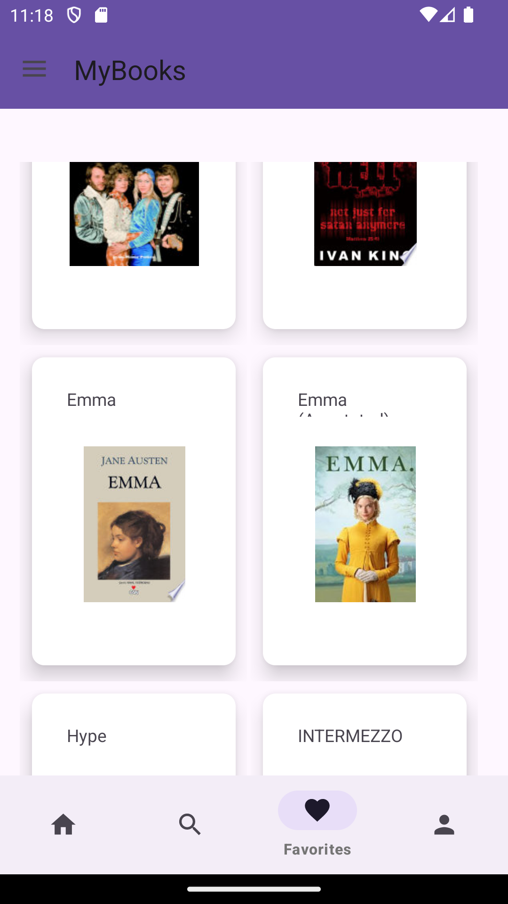

# MyBooks
 MyBooks is an Android application developed for users to search and find the books they want to read and add them to their reading lists, add the books they have read and liked to their favourites, mark the book as read after viewing the book details, write comments about the book and see how many books they have read from their profiles.

*IN PROGRESS*

Technologies used;

* MVVM,
* Retrofit,
* GoogleBooksAPI,
* Firebase Authentication,
* Firebase Firestore,
* RecyclerView,
* XML,
* DataBinding

## 📸 Screenshots

|           |          |            |
|:----------------------------------------------------------------------:|:----------------------------------------------------------------------:|:----------------------------------------------------------------------:|
|                            **WELCOME PAGE**                            |                           **REGISTER PAGE**                            |                             **LOGIN PAGE**                             |

|      |                  |          |
|:----------------------------------------------------------------------:|:----------------------------------------------------------------------:|:----------------------------------------------------------------------:|
|                        **FAVOURITES PAGE**                        |                             **NAVIGATION DRAWER**                              |                           **READ PAGE**                           |

|         |   
|:----------------------------------------------------------------------:   |
|                             **READING PAGE**                              | 

